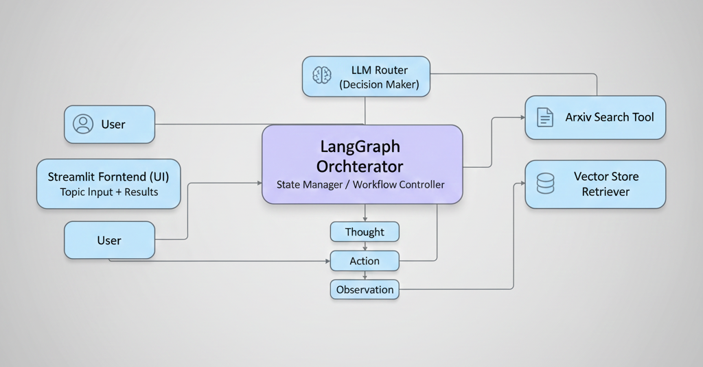

# PaperMind AI — Research Agent

This project implements an AI research agent that searches for papers, summarizes them, synthesizes insights, critiques the synthesis, and identifies knowledge gaps.



## Setup
1. Install Dependencies

```
pip install -r requirements.txt
```

2. Environment Variables

Create a .env file and include your API keys, for example:
```
OPENROUTER_API_KEY=your_key_here
```

## Running the App
▶️ Streamlit App (Recommended)

Run the interactive UI:
```
streamlit run streamlit_app.py
```
